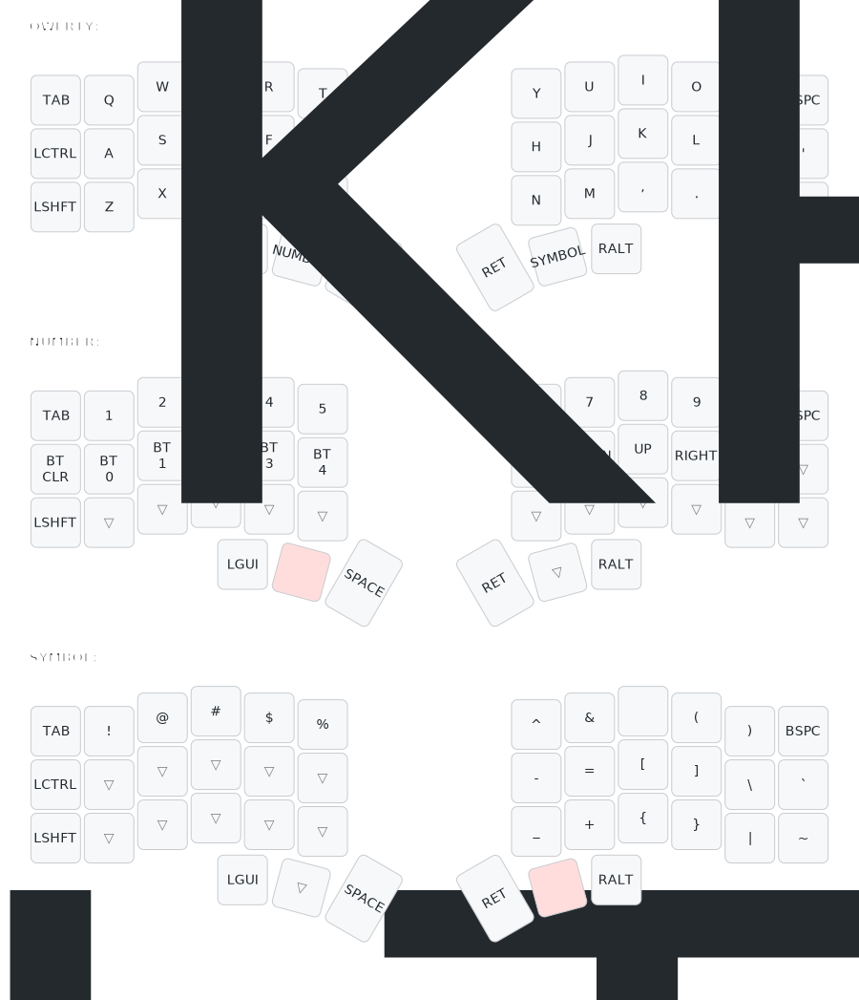

### Custom ZMK Keyboard Firmware

[View the keyboard layout](https://keymap-drawer.streamlit.app/?zmk_url=https%3A%2F%2Fgithub.com%2Fjeffwilde%2Fzmk-config%2Fblob%2Fmain%2Fconfig%2Fcorneish_zen.keymap) in the [keyboard drawer](https://github.com/caksoylar/keymap-drawer) webapp.

[Edit the layout](https://nickcoutsos.github.io/keymap-editor/) using the [keymap-editor](https://github.com/nickcoutsos/keymap-editor) webapp.

A few of interesting related projects:
- [xMK](https://github.com/manna-harbour/xmk): run ZMK virtualized (in linux) with any keyboard.
- [nix-zmk](https://github.com/eraserhd/nix-zmk): Nix building and dev environments for ZMK
- [zmk-config-devcontainer](https://github.com/beta-tank/zmk-config-devcontainer): ZMK config with GH Actions, Devcontainer and Codespaces integrations
